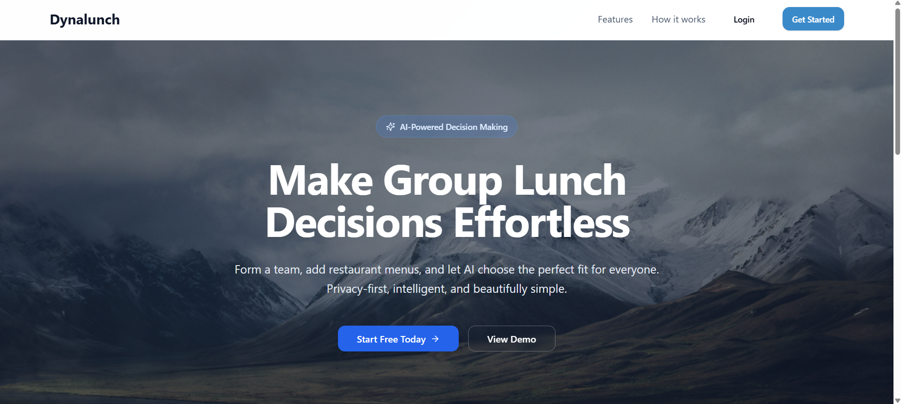
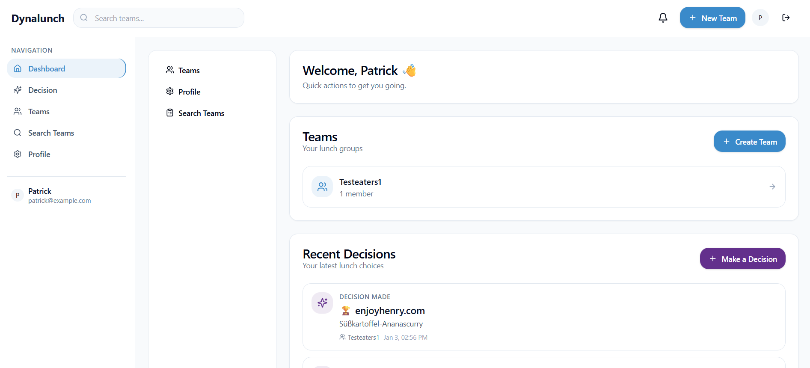

# Umamimatch – Lunch Decision Web App

A minimal end-to-end prototype to make group lunch decisions easier.

- Backend: FastAPI (Python), SQLite (local), LangChain + LangGraph (decision flow), crawl4ai + Playwright (web scraping)
- Frontend: Next.js (App Router, TypeScript), TailwindCSS, simple forms, JWT in headers + localStorage

## Screenshots

### Landing Page


### Dashboard


## Quick Start (Local Development)

Use this workflow for hackathon pairing and a shared local SQLite file.

## Local Development (Windows)

**Prerequisites:**
- Python 3.10+ (recommend 3.12)
- Node.js 18+ and npm
- Windows PowerShell

**Note:** Web scraping with Playwright can be flaky on Windows; use WSL/Linux if you hit browser runtime issues.

## Backend – Local Run

1) Create and activate a virtual environment

```powershell
python -m venv .venv
.\.venv\Scripts\Activate.ps1
cd backend
```

2) Install dependencies

```powershell
pip install -r requirements.txt
```

3) Configure environment

Copy the example file:

```powershell
cd ..
Copy-Item .env.example .env
cd backend
```

Default root `.env.example` values:

```env
# .env (repository root)
SECRET_KEY=change-me
DATABASE_URL=sqlite:///./data/umamimatch.db
CORS_ORIGINS=["http://localhost:3000","http://127.0.0.1:3000"]

# AI Provider Configuration
LLM_PROVIDER=openai
OPENAI_MODEL=gpt-4o-mini
# OPENAI_API_KEY=your-openai-api-key

# Vertex AI Configuration (optional when LLM_PROVIDER=vertexai)
# GOOGLE_CLOUD_PROJECT=your-project-id
# GOOGLE_APPLICATION_CREDENTIALS=app/secrets/your-credentials.json
```

4) Start the API

```powershell
uvicorn app.main:app --reload --port 8000
```

- Health check: http://localhost:8000/health
- OpenAPI docs: http://localhost:8000/docs

Database will be created automatically at `backend/data/umamimatch.db`.

## Frontend – Local Run

1) Install dependencies

```powershell
cd ../frontend
npm install
```

2) Configure API base URL (if different)

By default the app uses `http://localhost:8000`. To override, set:

```powershell
$env:NEXT_PUBLIC_API_BASE_URL = "http://localhost:8000"
```

3) Start the dev server

```powershell
npm run dev
```

Visit http://localhost:3000

## Basic Flow (MVP)

1) Signup and Login

- Use the UI at `/auth/signup` or `/auth/login`.
- JWT is stored in localStorage and sent via Authorization header.

2) Profile

- Go to `/profile` to view/update your profile (budget, allergies, diet, etc.).

3) Decision

- Go to `/decision` and paste menu URLs (one per line). Example:
  - https://www.enjoyhenry.com/menuplan-bdo/
- Click "Run Decision": the backend will create restaurant entries, scrape menus, and compute a ranking.

Note: Some sites render menus dynamically. If scraping returns no items, we’ll add a site-specific adapter or a Playwright fallback in the next iteration.

## API Overview (MVP)

- `POST /auth/signup` – returns `{ user, token }`
- `POST /auth/login` – returns `{ user, token }`
- `GET /profiles/me` – current user profile
- `PUT /profiles/me` – update profile
- `POST /restaurants` – add a restaurant `{ url, displayName? }`
- `GET /restaurants` – list restaurants
- `GET /restaurants/{id}` – get restaurant
- `GET /restaurants/{id}/menu` – list menu items
- `POST /restaurants/{id}/rescrape` – fetch & parse menu
- `POST /decision` – run decision flow across participants and restaurants

## Architecture Notes

- Backend organized in `app/` by feature: `api/`, `core/`, `db/`, `scraping/`, `decision/`.
- Scraping is modular. Default adapter uses `requests + BeautifulSoup`. You can add site-specific adapters or Playwright support in `app/scraping/adapters/`.
- Decision flow uses a minimal LangGraph pipeline with heuristic scoring. LLM tiebreakers can be added later.

## Next Steps

- Add dynamic-site support (Playwright) and/or site-specific adapter for enjoyhenry.com.
- Add participant selection UI to support groups (beyond "me only").
- Add restaurant management UI (add/list/select), background re-scrape.
- Improve heuristics and add optional LLM tiebreaker in LangGraph.
- Migrate DB to Postgres and add Docker + GCP deployment.

## Dev Tips

- Run FastAPI in `backend/` so SQLite path resolves correctly.
- Keep a single env file at repository root: `.env`.
- If CORS errors occur, update `CORS_ORIGINS` in root `.env`.
- If the decision result is empty, check `/restaurants/{id}/menu` to verify that scraping found items.
